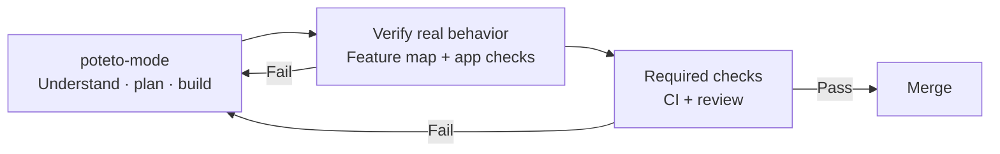

# Open Pstack, maintained by Arjit

**Stop bad code before your agents ship it.**

Pstack helps you build a repo where agents must prove a change works before it can merge. `poteto-mode` gives them the engineering process; a repo-specific verification skill checks real features. Your codebase, static checks, CI, and merge rules make the requirements enforceable. When you catch a mistake, turn it into a check or constraint that prevents it from recurring.



To make it work in **your** repo, [configure your models](#1-set-up-the-models), [create a verification skill](#2-add-verification-for-your-repository), then [use poteto-mode for each change](#3-use-poteto-mode). The verification skill includes a **feature map**: what your app does and how to check it. Keep that map current with `maintain-verification-skill` as the app changes. The goal is to catch mistakes through repeatable checks instead of trusting an agent's claim that it is done.

This distribution brings Pstack to **Codex and Claude Code**, with **Anthropic Claude, OpenAI Codex, xAI Grok, Devin, Cursor, Antigravity, and OpenCode** workers. You choose which models handle each role and which backups may take over. See the [provider table](#supported-parent-apps-and-worker-providers).

Arjit Jaiswal maintains this distribution's provider integrations and tested releases while tracking Lauren Tan's original Pstack directly. It builds on Eric Litman's Open Pstack port, with [attribution preserved](NOTICE.md).

[](https://github.com/arjitj2/open-pstack/actions/workflows/ci.yml)
[](https://github.com/arjitj2/open-pstack/releases/latest)
[](LICENSE)

## Why use this distribution

Choose based on where you run Pstack and how you want to use your model subscriptions:

- **Cursor’s original Pstack** is Lauren Tan’s engineering workflow for Cursor. It assigns work to models available inside Cursor. Use it when Cursor is your parent app.
- **Eric Litman’s Open Pstack** brings those workflows to Codex and Claude Code, with Claude, Codex, and Grok workers. It provides the foundation for this distribution.
- **This distribution** adds Devin, Cursor, Antigravity, and OpenCode CLI workers, subscription-aware model recommendations, setup that checks only the providers you select, and automatic recovery through your approved backup chains. It tracks Cursor directly and publishes its own tested releases, without waiting for Eric’s port to incorporate changes.

Routing follows the role assignments you approve. Setup recommends a mix based on task fit and confirmed access. The saved policy controls which models run and when a backup can take over.

Recovery can cover recognized quota limits, unavailable routes, terminal backend failures, and explicitly configured deadlines. Existing configurations remain quota-only until a broader policy is saved. A quiet worker is not assumed to have failed; an exhausted parent or a chain with no safe, approved backup cannot recover automatically. See the [recovery contract](plugins/pstack/skills/poteto-mode/references/provider-dispatch.md#saved-fallback-and-backend-recovery).

## Supported parent apps and worker providers

The **parent** is the app where you start a task. It coordinates the work and keeps your tools and conversation context. A **worker** is a model it delegates a bounded task to.

| Worker provider | Descriptor prefix | From a Codex parent | From a Claude Code parent |
| --- | --- | --- | --- |
| OpenAI / Codex | `codex` | Native Codex subagent | External `codex` CLI |
| Anthropic / Claude | `claude` | External `claude` CLI | Native Claude Code subagent for a shipped lane; external `claude` CLI for other models |
| xAI / Grok | `grok` | External `grok` CLI | External `grok` CLI |
| Devin models | `devin` | External `devin` CLI | External `devin` CLI |
| Cursor models | `cursor` | External `cursor-agent` CLI | External `cursor-agent` CLI |
| Antigravity models | `antigravity` | External `agy` CLI | External `agy` CLI |
| OpenCode models | `opencode` | External `opencode` CLI | External `opencode` CLI |

**This distribution supports Codex (`codex`) and Claude Code (`claude`) as parents.** For Cursor as your parent app, use [Cursor's original Pstack](https://github.com/cursor/plugins/tree/main/pstack). Provider availability does not guarantee access to every model: setup checks the exact models you select.

External workers use their own authentication and do not inherit the parent's MCP connections. Why and Reflect stay native so they retain those tools. See the [provider dispatch contract](plugins/pstack/skills/poteto-mode/references/provider-dispatch.md) for supported models and permissions, and the [provider limits](plugins/pstack/skills/poteto-mode/references/provider-dispatch.md) for what each worker cannot do.

OpenCode workers are opt-in. They require an exact `opencode:<provider>/<model>@default` assignment and explicit API-spend approval because subscription-only routing is unproven. Read-only workers inspect files. Writers edit a Git worktree root, but neither mode runs shell commands or builds. Initial support uses built-in OpenCode providers and native authentication. See [OpenCode worker limits](plugins/pstack/skills/poteto-mode/references/provider-dispatch.md#optional-opencode-models).

## Install

Start with a current Claude Code or Codex installation. Install and sign in to the command-line tools for the external providers you choose; unused providers are optional. [Bun](https://bun.sh) runs Pstack's local routing tools. Setup checks access before saving your model choices.

Install directly from this repository. Its default branch, `main`, contains changes validated and ready for users. You do not need GitHub CLI, a version tag, or a separate release channel. If you already installed from a tag or another distribution, see [Update, switch, or roll back](#update-switch-or-roll-back).

### Claude Code

Run these commands inside Claude Code:

```text
/plugin marketplace add arjitj2/open-pstack
/plugin install pstack@open-pstack
```

Then run `/reload-plugins` inside Claude Code, or start a new session.

### Codex

Run these commands in your shell:

```shell
codex plugin marketplace add arjitj2/open-pstack
codex plugin add pstack@open-pstack
```

Turn on Codex subagents in `~/.codex/config.toml` so pstack can compare work in parallel:

```toml
[features]
multi_agent = true
```

Start a new Codex task after installation so it can discover the new skills and setting.

## Get started

Configure model access, establish verification for your repository, then start a task.

### 1. Set up the models

In Claude Code, run:

```text
/pstack:setup-pstack
```

In the Codex app, type `/` and select `pstack:setup-pstack` from the skill list. You can also mention the skill with `$pstack:setup-pstack`. In Codex CLI, use `/skills` or type `$pstack:setup-pstack`. Asking for the skill by name works too; the words “Use pstack” are not required. See OpenAI's [slash commands](https://learn.chatgpt.com/docs/reference/slash-commands) and [skill invocation](https://learn.chatgpt.com/docs/build-skills#how-chatgpt-and-codex-use-skills).

Setup discovers the models you can run, asks about subscriptions it cannot verify, and recommends assignments for each role. It shows which models will run natively and which will use external workers, then asks before saving. Included subscription access and permission for metered API spending are recorded separately; unknown remaining capacity stays unknown.

You can save an ordered backup chain for each role, with up to three attempts. During a run, Pstack follows those approved choices and reports substitutions. Recovery depends on the installed release and saved policy. See the [recovery contract](plugins/pstack/skills/poteto-mode/references/provider-dispatch.md#saved-fallback-and-backend-recovery). If a failed worker may have changed files, the parent inspects and preserves that work before continuing in a fresh workspace. An unsafe or ambiguous result stops that lane with a checkpoint.

Only selected providers need to pass setup. You can mix providers across implementation, investigation, and review or keep the configuration small. See the [model matrix](plugins/pstack/skills/poteto-mode/references/provider-dispatch.md#model-matrix) for recommended defaults and effort levels. Setup checks other model IDs through the provider’s listing or a successful probe.

For Antigravity, install and sign in to `agy`, then run `agy models`. Ask setup to assign an exact listed slug such as `antigravity:gemini-3.1-pro-high@default` and record your API-spend choice. Antigravity workers use file tools only, including in writer mode; the parent runs tests. See [Antigravity models](plugins/pstack/skills/poteto-mode/references/provider-dispatch.md#optional-antigravity-models).

### 2. Add verification for your repository

`setup-pstack` verifies model access, saves your approved model sheet and parent integration, reads them back, and runs a small worker-and-reviewer smoke test. It does **not** create an app feature map or schedule repository maintenance.

For a repository without a repeatable way to test real behavior, invoke `pstack:create-verification-skill`. It inspects how the app starts and can be driven, creates a project-local verification skill, and seeds a feature map with the first few user-facing features. Each entry describes how to reach the feature, exercise it, and recognize success. The generated skill must prove one mapped feature live before handoff; that initial map is a starting point, not a claim of complete coverage.

Use `pstack:maintain-verification-skill` as the app changes. It checks the map against source and live behavior and can propose a PR correcting drift. These skills work through the same picker or mention mechanism described above. Use `/pstack:create-verification-skill` and `/pstack:maintain-verification-skill` in Claude Code.

This release includes the creation and maintenance workflows, but no automatic feature-map maintenance schedule. Recurring upkeep must be configured separately in your parent app or another scheduler. Installing Pstack does not silently start background jobs.

### 3. Use poteto-mode

Start any task that needs careful engineering with `poteto-mode`.

In Claude Code:

```text
/pstack:poteto-mode Add saved filters to search. Keep the design simple, verify it in the real app, and open a pull request.
```

In the Codex app, type `/`, select `pstack:poteto-mode`, and add your task. A skill mention also works in Codex:

```text
$pstack:poteto-mode Add saved filters to search. Keep the design simple, verify it in the real app, and open a pull request.
```

In this example, poteto-mode first examines the existing search implementation before deciding how to add saved filters. It settles how saved filters are stored before writing code, then implements the smallest complete version. It runs the feature the way a user would, reviews the result, and prepares the pull request.

The skill name is `poteto-mode`, spelled with an “e”. Claude Code also loads this distribution's startup instruction for non-trivial engineering work. In Codex, select the skill explicitly or add a standing instruction if you want it used by default. Model setup saves routing preferences; it does not install an always-on Codex workflow instruction.

Use the verification skill for each change. If you add or change a feature, update its entry in the feature map too. The other skills are there when poteto-mode needs them or when you want to call one directly.

## Useful skills

| Skill | Use it when |
| --- | --- |
| `how` | You want a clear explanation of how part of the system works. |
| `why` | You want evidence for why the system was built that way. |
| `architect` | A change crosses a function or module boundary and the design needs to be settled first. |
| `arena` | You want several complete attempts, followed by a comparison of their best parts. |
| `interrogate` | You want different models to try to break a design or diff. |
| `create-verification-skill` | Your project has no repeatable way for an agent to prove real behavior. |
| `maintain-verification-skill` | The project's verification instructions no longer match the product. |
| `babysit` | A pull request needs CI failures and review comments handled until it is ready. |
| `reflect` | A hard task is finished and its lessons should improve the next run. |

Plugin skills include `pstack:` in their name. In Claude Code, invoke `/pstack:architect`. In Codex, select `pstack:architect` from the skill picker or mention `$pstack:architect`. Browse the [packaged skills](plugins/pstack/skills/) for each skill's description and instructions.

## Models and token use

Some pstack workflows use one model. Skills such as `architect`, `arena`, and `interrogate` can run several models in parallel. Each model run uses the access configured for its native app or external CLI: included subscription capacity or explicitly approved API spending.

`setup-pstack` lets you choose the models, one requested effort per assigned provider and model, and how many run in parallel. Choose role assignments first; setup checks only the models those roles use. Unused providers need no CLI or subscription. If a selected model fails, repair its availability or explicitly change the affected roles before saving. A model from the app you are using runs inside that app when a shipped native lane covers it. Other models run through their own command-line tools. Open Pstack does not quietly replace a failed model with a weaker one.

## Learn from the original

[Lauren's talk on building trustworthy coding agents](https://x.com/poteto/status/2102050467505430555) explains how verification, engineering skills, and repo design work together.

Lauren's [pstack guide](https://github.com/cursor/plugins/tree/main/pstack/docs/guide) walks through a real task, verification, and longer unattended runs. It uses Cursor's interface, but the ideas are the same. Use the translated skill invocations above in Claude Code or Codex.

More about this repository:

- [the original README at the incorporated Cursor commit](UPSTREAM.md#current-sync-point);
- [the contributor guide](CONTRIBUTING.md) for development tools and validation;
- [the upstream sync record](UPSTREAM.md) and maintainer procedure;
- [the change history](CHANGELOG.md) with each release's Cursor baseline and validation evidence; and
- [the attribution record](NOTICE.md) for Pstack, the imported Cursor Team Kit skills, and other contributions.

## How releases track Cursor’s Pstack

This distribution has its own release numbers. Each version in the [change history](CHANGELOG.md) records the Cursor Pstack version and exact source commit it incorporates. [UPSTREAM.md](UPSTREAM.md) lists the current adaptations and exclusions, and the [release notes](https://github.com/arjitj2/open-pstack/releases) describe each tagged checkpoint.

Scheduled checks detect changes in Cursor’s original Pstack and propose them for review. Each adoption adapts the change to the shared Codex and Claude Code skill tree and tests the affected behavior in the real parent apps before release. Pending changes remain visible until they are adopted, adapted, or excluded with a reason. Detection does not mean the change is included.

Provider discovery, model routing, and recovery are developed in this distribution. Useful fixes from Eric’s port and other sources are reviewed separately.

## Update, switch, or roll back

Your model sheet and parent integration are separate from the plugin files. Updating, switching, or pinning a release does not rewrite them.

### Update an installation that follows main

In Claude Code, run `/plugin marketplace update open-pstack`, or run `claude plugin update pstack@open-pstack` in your terminal. To update automatically, open `/plugin`, select **Marketplaces**, and turn on automatic updates for `open-pstack`. Then run `/reload-plugins` or start a new session.

In Codex, run `codex plugin marketplace upgrade open-pstack` to refresh the catalog. Apply the available plugin update through Codex's plugin management, then start a new task. Refreshing the catalog does not reload the plugin in a task that is already running.

After an update, run `setup-pstack` once. It migrates older versioned Fable, Opus, and Sonnet entries to rolling aliases and keeps your role assignments and efforts. Until you run it, Pstack applies the same migration at run time without saving it.

### Switch from a pinned tag or another distribution

Register the marketplace again without a ref. For Codex, run:

```shell
codex plugin remove pstack@open-pstack
codex plugin marketplace remove open-pstack
codex plugin marketplace add arjitj2/open-pstack
codex plugin add pstack@open-pstack
```

For Claude Code, run:

```shell
claude plugin uninstall pstack@open-pstack
claude plugin marketplace remove open-pstack
claude plugin marketplace add arjitj2/open-pstack
claude plugin install pstack@open-pstack
```

If a command fails, fix the reported problem, then retry from the step that failed. These commands use the default user scope. If you installed the Claude Code plugin in project or local scope, keep that scope.

Then run `/reload-plugins` in Claude Code or start a new session. In Codex, open a new task. The marketplace name stays `open-pstack`, and the skills stay under `pstack:`.

### Pin a release or roll back

Pick a tag from the [change history](CHANGELOG.md). Remove the plugin and marketplace as shown above, then register the marketplace at that tag:

```shell
codex plugin marketplace add arjitj2/open-pstack --ref <release-tag>
claude plugin marketplace add arjitj2/open-pstack#<release-tag>
```

Install the plugin again with the same command as before. A pinned installation stays on that tag until you register the marketplace again without a ref. A release does not include worker providers added after it. If your model sheet assigns one, run `setup-pstack` and assign a provider that release supports.

## Contributing

Fixes for Claude Code or Codex and help bringing over new pstack releases are welcome. Search [GitHub Issues](https://github.com/arjitj2/open-pstack/issues) before opening a new issue. For larger behavior changes, explain why the change belongs in Open Pstack instead of Lauren's original project.

Read [CONTRIBUTING.md](CONTRIBUTING.md) and [UPSTREAM.md](UPSTREAM.md) before changing content brought over from Lauren's pstack. Pull requests must keep one shared skill tree for Claude Code and Codex and pass the repository's tests, type checks, plugin validation, and static checks.

## License

MIT. pstack was created by Lauren Tan. Open Pstack builds on Michael Denyer's [pstack-claude](https://github.com/michael-denyer/pstack-claude) port and includes attributed MIT-licensed work from Cursor Team Kit and Superpowers. See [NOTICE.md](NOTICE.md) for attribution and [LICENSES/](LICENSES/) for the Cursor Team Kit and Superpowers license texts.
